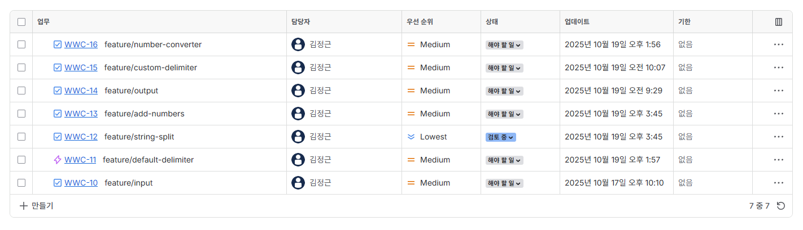

# kotlin-calculator-precourse

## 기능 목록

기능 목록은 아래와 같은 형식을 따름
> - [x] **{기능명}** : ({branch-type}/{ticket-number}-{description})

- [x] **입력 : (feature/WWC-10-input)**
    - [x] 구분자와 숫자로 구성된 문자열을 입력 받음
- [x] **커스텀 구분자 처리 : (feature/WWC-15-custom-delimiter)**
    - [x] 커스텀 문자열 형식을 판단
        - 커스텀 구분자 문자열은 전체 문자열에서 맨 앞에 와야 함
        - 빈문자는 커스텀 구분자로 등록할 수 없어야 함
    - [x] 커스텀 구분자 예약 부분(//x\n) 제외하여 저장
- [x] **구분자 처리 : (feature/WWC-11-default-delimiter)**
    - [x] 기본 구분자 + 커스텀 구분자를 기준으로 문자열을 나눔
- [ ] **숫자 변환기 : (feature/WWC-16-number-converter)**
    - [ ] 최종적으로 나눠진 문자열 각각들을 숫자로 변환 함
    - [ ] 숫자로 변환할 수 없는 문자가 있을 경우 예외를 던짐
- [ ] **더하기 처리기 : (feature/WWC-13-add-numbers)**
    - [ ] 전달 받은 숫자들을 덧셈 연산 함
    - [ ] 덧셈 후, 저장할 수 있는 수의 크기를 넘을 경우(MAX+MAX) 예외를 던짐
- [ ] **출력 : (feature/WWC-14-output)**
    - [ ] 출력 형식에 맞게 출력 함



## 입력 상황 정리

| Index | 요약                   | 입력                     | 예상 출력                      | 사유                                                                                                                                                                                             |
|-------|----------------------|------------------------|----------------------------|------------------------------------------------------------------------------------------------------------------------------------------------------------------------------------------------|
| 1     | 음수                   | `-1`                   | `IllegalArgumentException` | 입출력 요구 사항에서 "**구분자와 양수**로 구성된 문자열"을 받는다고 명시되어 있음                                                                                                                                               |
| 2     | 빈 문자 커스텀 구분자         | `//\n123`              | `IllegalArgumentException` | 기능 요구 사항에서 "사이에 위치하는 **문자**를 컴스텀 구분자로 사용"한다고 되어있음, 해당 경우는 문자 자체가 없기 때문에 예외에 해당함                                                                                                                |
| 3     | 문자열 중간에서 컴스텀 구분자를 지정 | `1:2//>\n1>2`          | `IllegalArgumentException` | 기능 요구 사항에서 "**문자열 앞부분**"이라고 명시되어 있음                                                                                                                                                            |
| 4     | 정수 커스텀 구분자           | `//1\n2`               | `IllegalArgumentException` | 커스텀 구분자를 정수로 입력 받은 경우에는 해당 정수를 연산할 수 없기에 예외 사항으로 처리함                                                                                                                                           |
| 5     | \ 커스텀 구분자            | `//\\n1\2\3`           | `결과 : 6`                   | 정상적인 입력임                                                                                                                                                                                       |
| 6     | / 커스텀 구분자            | `///\n1/2/3`           | `결과: 6`                    | 정상적인 입력임                                                                                                                                                                                       |
| 7     | . 커스텀 구분자            | `//.\n1.2.3`           | `결과 : 6`                   | 입출력 요구 사항에서 입력값은 **양수**(**정수** 및 **실수**)로 구성된 문자열이므로, 커스텀 구분자로 `.`을 사용할 경우 실수의 소수점과 구분자를 구별할 수 없어 예외로 처리 해야 될 수 있지만, 기능 요구 사항에서 "**숫자**를 추출하여 더하는 계산기"라도 수의 범위를 줄였으므로 최종적으로 0~9의 자연수만 덧셈연산하게 됨 |
| 8     | 연속 구분자               | `1:2:::3`              | `결과 : 6`                   | 기능 요구 사항에서 `"" => 0`으로 명시했으므로, `1::2`는 `1:0:2`로 계산할 수 있음                                                                                                                                       |
| 9     | 구분자만                 | `:`<br/> `::,,`        | `결과 : 0`                   | 기능 요구 사항에서 `"" => 0`으로 명시했으므로, `1::2`는 `1:0:2`로 계산할 수 있음                                                                                                                                       |
| 10    | 커스텀 구분자만             | `//>\n`<br/> `//>\n>>` | `결과 : 0`                   | 기능 요구 사항에서 `"" => 0`으로 명시했으므로, `1::2`는 `1:0:2`로 계산할 수 있음                                                                                                                                       |
| 11    | " "(공백) 커스텀 구분자      | `// \n1 2 3`           | `결과 : 6`                   | 정상적인 입력임                                                                                                                                                                                       |
| 12    | 탭 커스텀 구분자            | `//	\n1	3`             | `결과 : 4`                   | 정상적인 입력임                                                                                                                                                                                       |
| 13    | 커스텀 구분자 + 기본 구분자     | `//+\n1,2:3+4`         | `결과 : 10`                  | 정상적인 입력임                                                                                                                                                                                       |
| 14    | 2자리 이상 양수 덧셈         | `1:11:222`             | `IllegalArgumentException` | **수**가 아닌, **숫자**이므로, 두 자리 이상의 수는 문제 기능 요구 사항에 맞지 않음                                                                                                                                           |
| 15    | 빈 문자                 |                        | `결과 : 0`                   | 정상적인 입력임                                                                                                                                                                                       |

## 파일 구조

```dir
.
├── README.md
├── res
│   └── Jira.png
├── settings.gradle
└── src
    ├── main
    │   └── kotlin
    │       └── calculator
    │           ├── Application.kt
    │           ├── controller
    │           │   └── CalculatorController.kt
    │           │   ├── CustomDelimiterController.kt
    │           │   └── SplitController.kt
    │           ├── model
    │           │   ├── domain
    │           │   │   └── TextData.kt
    │           │   └── repository
    │           │       └── TextRepository.kt
    │           └── view
    │               ├── ConsoleInputView.kt
    │               └── InputView.kt
    └── test 
       └── kotlin 
            └── calculator 
                ├── ApplicationTest.kt 
                ├── controller
                │   └── CustomDelimiterTest.kt
                ├── model
                │   └── SplitTest.kt
                └── view 
                    └── InputTest.kt
                    
69 directories, 223 files
```